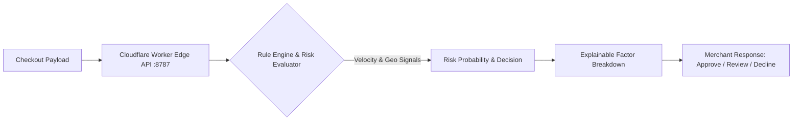

# 🛡️ FraudShield — E-Commerce Fraud Risk Detection Engine

<p align="center">
  <strong>A Cloudflare-native fraud scoring engine combining edge computing with transparent rule-based risk evaluation and ML pipelines.</strong>
</p>

<p align="center">
  <a href="#license"></a>
  <a href="https://workers.cloudflare.com"></a>
  <a href="https://nodejs.org"></a>
  <a href="https://scikit-learn.org"></a>
</p>

---

## 📌 Overview

**FraudShield** is an edge-deployed e-commerce transaction risk evaluation system. It allows online retailers and merchant platforms to evaluate transaction risk signals with sub-millisecond latency.

When a checkout transaction occurs, the Cloudflare Worker analyzes high-risk velocity patterns, home-to-transaction location anomalies, new account velocity, international card mismatches, and failed attempt thresholds, returning a transparent composite risk score with explainable risk factors.

---

## ✨ Key Features

- **⚡ Sub-Millisecond Edge Evaluation:** Deployed globally on Cloudflare Workers with zero cold starts.
- **🔍 Explainable Risk Signals:** Rather than a black-box verdict, every score returns the specific contributing risk factors (e.g. `High transaction amount`, `Account age < 7 days`, `Rapid retry velocity`, `Cross-state or long-distance anomaly`).
- **🎛️ Interactive Fraud Inspector UI:** Single-page frontend allowing risk analysts to simulate scenarios, test risk thresholds, and inspect real-time response payloads.
- **🤖 Offline Machine Learning Pipeline:** Python-based ML training suite (`training/train_model.py`) featuring XGBoost and scikit-learn models for historical fraud pattern classification.

---

## 🏗️ Architecture



---

## 🚀 Quick Start

### Prerequisites
- **Node.js:** v18+
- **Wrangler CLI:** `npm install -g wrangler`

### Local Development

```bash
# Clone the repository
git clone https://github.com/MadanMohan0537/E-Commerce-Fraud-Detection.git
cd E-Commerce-Fraud-Detection

# Install dependencies
npm install

# Start local worker emulator & UI
npm run dev
```

Open [http://localhost:8787](http://localhost:8787) in your browser.

### Deployment

```bash
# Deploy to Cloudflare Workers
npm run deploy
```

---

## 📡 API Reference

### `POST /predict`

Evaluate transaction risk attributes:

```bash
curl -X POST http://localhost:8787/predict \
  -H "Content-Type: application/json" \
  -d '{
    "transaction_amount": 6000,
    "account_age_days": 5,
    "num_transactions_today": 8,
    "home_state": "CA",
    "home_city": "Los Angeles",
    "transaction_state": "NY",
    "transaction_city": "New York City",
    "distance_from_home_miles": 2445,
    "transaction_date": "2026-08-19",
    "hour_of_day": 2,
    "is_international": 1,
    "failed_attempts": 3
  }'
```

**Example Response:**
```json
{
  "risk_score": 0.82,
  "verdict": "REVIEW",
  "fraud": true,
  "factors": [
    "High transaction amount relative to account history",
    "New account created within 7 days",
    "Cross-state or long-distance anomaly (>500km from primary billing)",
    "Abnormal transaction hour (02:00 AM)",
    "Multiple failed checkout attempts"
  ]
}
```

---

## 🔬 Offline ML Experimentation

To experiment with offline supervised fraud classification:

```bash
pip install -r requirements-training.txt
python training/train_model.py
```

---

## 📄 License

MIT License — see [LICENSE](LICENSE) for details.
